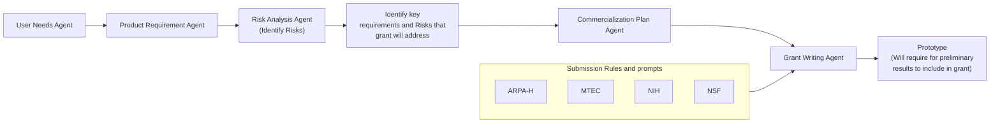

# BioMed Grant Writing Agent Team

## Workflow


## Setup

1. Install uv (if not already installed)
```bash
curl -LsSf https://astral.sh/uv/install.sh | sh
```

2. Clone the repository
```bash
git clone https://github.com/designplex/grant-writing-team.git
cd grant-writing-team
```

3. Setup Python environment
```bash
uv venv
source .venv/bin/activate
uv pip install -e .
```

4. Set up environment variables
```bash
cp .env.example .env
# Edit .env with your API keys
```

## Usage

Run the grant writing team with a prompt:
```bash
python swarm.py "Describe the user needs for a novel blood glucose monitoring device"
```